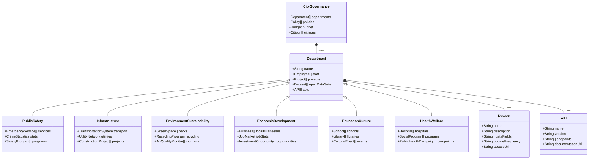

# Architecture

## Preamble

We are a City DAO dedicated to the promotion and integration of Web3 technologies into everyday civic life. By fostering education and collaboration, we aim to create a more informed and equitable digital future. We are a grassroots organization bound to Fort Worth Texas and dedicated to improving the Fort Worth community through Web3.

### Article 1: Name and Purpose

The name of the DAO is the "Fort Worth DAO," henceforth referred to as "FWTX DAO."

The DAO's primary purpose is to progress urban development and citizen engagement in Fort Worth, Texas, harnessing the potential of Web3 technologies. We aim to establish Fort Worth as a leading Web3 city.

### Article 2: Membership

Membership in the FWTX DAO is open to individuals passionate about our mission and committed to contributing to the DAO's objectives as described in this document.

Members are expected to uphold the DAO's constitution, respect its values, and conduct themselves professionally and ethically. Membership of an individual can be terminated by a majority vote.

Each member enjoys equal voting rights. One member equals one vote.

### Article 3: Leadership and Governance

Regarding Governance, The FWTX DAO will substantially follow the essence of the parliamentary rules of Robert's Rules of Order.

Through the end of 2024, the two (2) Founders will be the Chair. After 2024 ends, the membership will optionally be able to submit names to fill the role of the Chair. The Chair of the FWTX DAO may be one or more members of the DAO, but not to exceed three members. The Chair replacing the Founders after the year 2024 ends will be elected through a proposal. This process of electing a new Chair will be optionally repeated on an annual basis, which will be 12 months or more from the previous Chair election.

For a proposal to be recognized before it can be seconded by a member and presented for discussion and a vote, the proposal must be recognized by the Chair. This recognition is to occur offchain in real life (IRL) and documented electronically for record before the proposal is submitted onchain.

Voting will be defined as follows - A quorum (Minimum Participation) is 33% of the membership. A majority (Approval Threshold) is defined as 51% of the quorum. If the quorum is not met in the allotted time, the proposal will not pass.

The DAO shall elect, through a proposal, a leadership team consisting of five (5) members who will oversee day-to-day operations. The leadership team shall include roles such as Director, Coordinator, Operations Manager, Community Manager, and Treasurer. The leadership team will individually have specific responsibilities determined by the DAO's needs and assigned by the Chair offchain. The leadership team focuses on effective operation ensuring the DAO's vision is realized, and values are upheld.

Decisions outside of day-to-day operations within the DAO shall be made through a democratic voting process conducted onchain.

### Article 4: Financial Management

The DAO shall maintain a digital treasury wallet to manage its financial resources securely.

All financial decisions and significant financial transfers shall be approved by a majority vote of the members. The leadership team has the authority to approve smaller day-to-day expenses.

Members may suggest budgets and financial initiatives to the leadership team, which will evaluate them based on their alignment with the DAO's purpose and available resources.

An annual third-party audit shall be conducted to ensure the DAO's financial transparency and accountability.

A digital treasury wallet securely holds the DAO's financial resources.

### Article 5: Dispute Resolution and Grievances

Any disputes or grievances within the DAO shall first attempt to be resolved informally through dialogue and mediation.

If informal methods fail, the parties involved may agree to resolve the matter externally through arbitration or legal recourse.

### Article 6: Amendments, Dissolution, and Progress

This constitution may be amended by a majority vote of the members, ensuring a thorough review and discussion process.

The DAO may be dissolved only by a unanimous vote of the total members. This will require an external voting process outside the normal process used for the governance of the DAO as described in this Constitution, since the governance stated above does not accommodate a unanimous vote. In such an event, the remaining assets, including the treasury, shall be distributed in a manner proposed and approved by the membership, adhering to local regulations.

The DAO's progress is measured against the roadmap as found on the FWTX DAO official GitHub repository, with milestones celebrated and strategies adjusted, as needed to support the success of the DAO.

### Article 7: Commitment to Ethics and Compliance

The DAO and its members commit to upholding ethical standards, including data privacy, anti-discrimination, and anti-harassment policies.

Members shall adhere to all relevant local and national laws and regulations pertaining to their activities within the DAO.

## City DAO Data Ontology 

